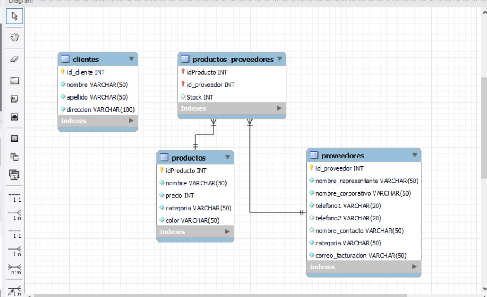

# sprintmodulo3
# EVALUACIÓN FINAL MÓDULO 3

Creación de una base de datos relacional utlizando lenguaje SQL para dar solución a un problema de almacenamiento de información, en conformidad a lo aprendido en el Módulo 3 "Fundamentos de Bases de Datos Relacionales" del BootCamp "Desarrollo de Aplicaciones Full Stack Java Trainee v2.0" impartido por FUDESCO en el marco de la iniciativa público - privada Talento Digital para Chile, impulsada por Fundación Chile y Fundación Kodea.

## INSTRUCCIONES

Si tienes GitHub Desktop y/o GitHub puedes clonar el código a tu ordenador local desde la terminal, utilizando el comando git clone <https://github.com/alberto5614/sprintmodulo3.git> o hacer click en "Download Zip" para descargar la carpeta en tu ordenador local.

## CONSTRUIDO CON

- SQL

## PREVISUALIZACIÓN DIAGRAMA

## AUTORES :busts_in_silhouette:

- Hervin Alberto Pradines Frías
- Enmanuel Francisco Pérez García
- Johann Mauricio Candia Llanca
- Daniela Inostroza Ávila

## REPOSITORIO GITHUB :computer:

https://github.com/alberto5614/sprintmodulo3.git

## CONTRIBUCIÓN :sparkles:

Si quieres contribuir con la base de datos realiza el "Pull Request"/"Petición de Validación". Muchas gracias!
